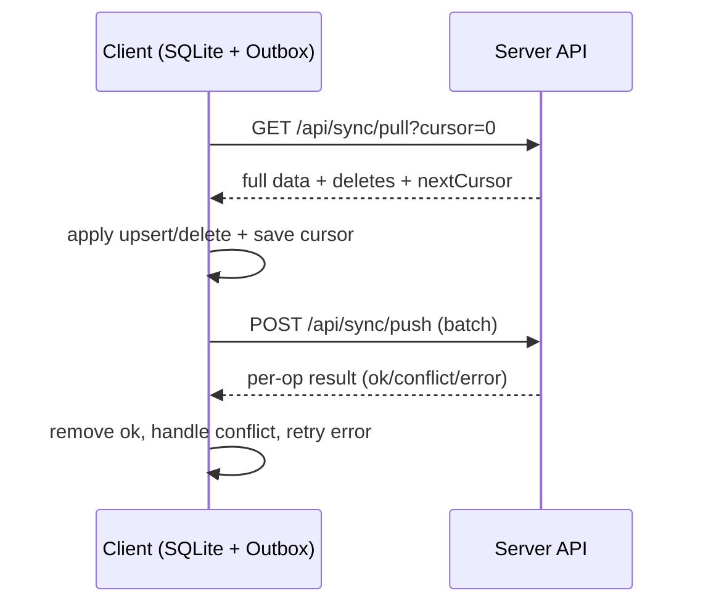

# Offline-first Sync Design (SQLite + Outbox)

Muc tieu: dong bo 2 chieu, ho tro offline CRUD, khong duplicate khi retry, giai quyet xung dot khi nhieu thiet bi cung thao tac, va giu server la source of truth.

## 1) Nguyen tac bat buoc
- Server la source of truth cuoi cung.
- Wallet currentBalance la projection do server tinh, client KHONG push currentBalance.
- Transaction la nguon su that cua tien.
- currentBalance = openingBalance + SUM(signed amount cua transaction non-deleted).
- Transaction amount luon duong; type INCOME => +amount, EXPENSE => -amount.
- Khong phu thuoc hoan toan vao category.type de tinh balance.
- Xoa la soft delete (deletedAt), khong hard delete.
- Moi entity sync phai co createdAt, updatedAt, deletedAt, version.
- Update/Delete phai co baseVersion de phat hien conflict.
- Retry push phai idempotent theo userId + deviceId + requestId.

## 2) Mo hinh du lieu (FE SQLite)
### Tables
- wallets: walletId, name, type, currency, openingBalance, currentBalance, description, createdAt, updatedAt, deletedAt, version
- categories: categoryId, name, type, icon, color, isDefault, isHidden, createdAt, updatedAt, deletedAt, version
- transactions: transactionId, walletId, categoryId, amount, type, note, date, createdAt, updatedAt, deletedAt, version
- outbox: outboxId (PK), requestId, deviceId, entity, entityId, op, baseVersion, dataJson, createdAt
- outbox (bo sung): status (pending/conflict/error), serverVersion, serverDataJson, error
- sync_state: key (PK), value (lastCursor, lastSyncAt)

### Ly do
- version + baseVersion: chong ghi de khi 2 thiet bi update cung luc.
- deletedAt: giu lich su xoa cho pull/push.
- outbox: dam bao push on-least-once nhung idempotent tren server.

## 3) Giao thuc dong bo
### 3.1 Pull (bootstrap va incremental)
- GET /api/sync/pull?cursor=0
  - tra ve full data + deletes cho wallets/categories/transactions
  - nextCursor lay tu sync_change_log moi nhat
- GET /api/sync/pull?cursor=lastCursor
  - tra ve changes/deletes sau cursor
  - nextCursor dua tren log da tra

FE ap dung:
1) apply deletes (set deletedAt) theo entity
2) apply upserts theo version
3) luu lastCursor

### 3.2 Push (outbox)
- POST /api/sync/push
- moi operation phai co requestId, baseVersion (update/delete)
- server check dedup userId + deviceId + requestId

FE thuc thi:
1) lay batch outbox theo thu tu FIFO
2) push batch
3) voi moi op ket qua:
   - ok: xoa outbox item, cap nhat local data = serverData (neu co)
   - conflict: luu serverData + serverVersion, danh dau can resolve
   - error: giu outbox va retry theo backoff

## 4) Xu ly conflict
Conflict xay ra khi baseVersion khong trung voi server version.
- Server tra status=conflict + serverVersion + serverData.
- FE chien luoc mac dinh: server-wins hoac UI cho chon.
- Neu muon ghi de: cap nhat local data theo serverVersion, tao op moi (requestId moi) va push lai.

## 5) Quy tac idempotent va retry
- requestId phai on dinh cho moi outbox record.
- Neu retry, giu nguyen requestId + deviceId.
- Server ghi dedup (userId, deviceId, requestId) => push lai se OK ma khong tao duplicate.

## 6) Wallet balance correctness
- Client khong tu tinh currentBalance, chi dung de display.
- Khi transaction thay doi, server cap nhat wallet currentBalance va ghi change log cho wallet.
- Vi the pull se co wallet thay doi neu transaction thay doi (multi-device co nhat quan).

## 7) Multi-device scenario
- Thiet bi A va B cung update 1 record:
  - B push sau se bi conflict vi baseVersion cu.
  - FE nhan serverData va quyet dinh merge/overwrite.
- Dedup dam bao khong duplicate khi retry.

## 8) Sequence (tom tat)

## 9) Mo rong sau
- Budgets/Savings/Debts co cung version/deletedAt, va duoc log trong sync_change_log.
- Chi can them entity mapping vao pull/push va local db schema.

## 10) Checklist trien khai
- FE: tao SQLite schema + migration runner
- FE: local-first repo + outbox queue
- FE: sync worker (push then pull) + conflict handler
- BE: sync push/pull + balance service (da co)
- Docs: cap nhat schema, API, va mo ta xung dot
